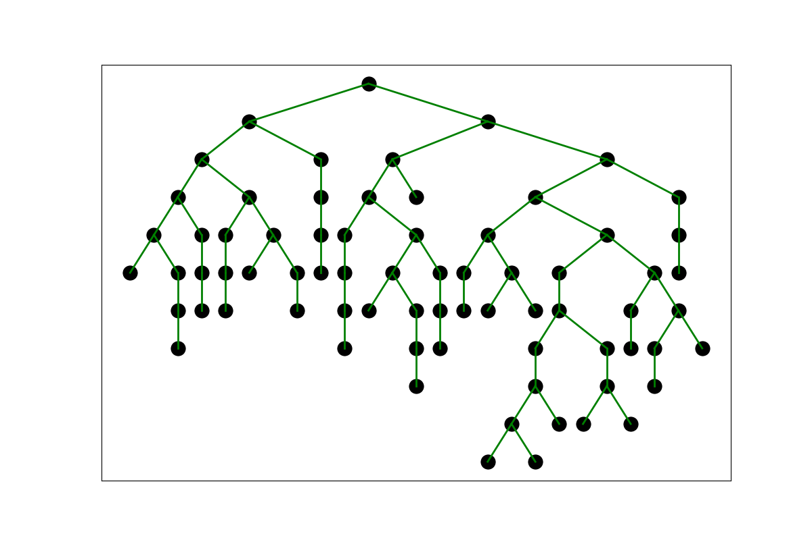

# Tree visualization tool


## Usage:
```
main.py [-h] [--node_color NODE_COLOR] [--edge_color EDGE_COLOR] graphs [graphs ...]

positional arguments:
  graphs                GraphML files

optional arguments:
  -h, --help            show this help message and exit
  --node_color NODE_COLOR
                        Colors from matplotlib: https://matplotlib.org/stable/
                        gallery/color/named_colors.html
  --edge_color EDGE_COLOR
                        Colors from matplotlib: https://matplotlib.org/stable/
                        gallery/color/named_colors.html
```

## Result example:

